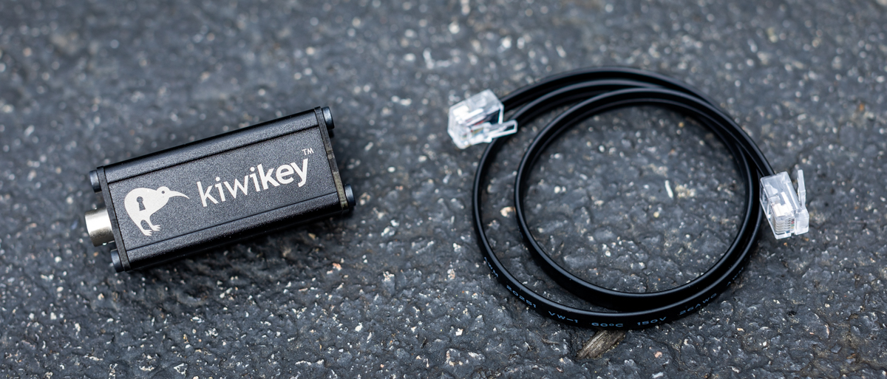
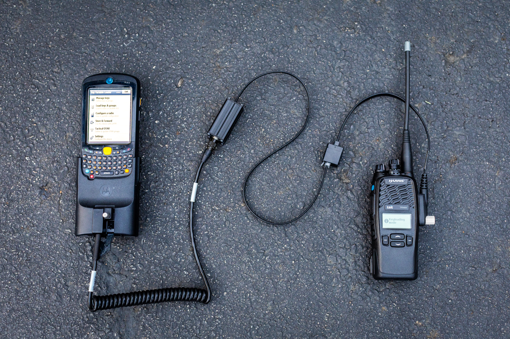

kiwi**key**™
============

The kiwi**key** is a P25 keyloading adapter that enables the use of TIA-102 standards-compliant keyloaders with Tait radios.

It provides comparable functionality to the Tait TPA-SV-020 keyloading adapter box.

## 🛒 [Order now!](https://shop.beepbooplabs.ltd/products/kiwikey)

## Usage instructions

### 1. Plug keyloader hirose cable into kiwi**key**

Connect the keyloader's male hirose connector to the `KFD` port on the kiwi**key**:

### 2. Plug kiwi**key** into the programming adapter

Connect the provided RJ12 cable to the `RADIO` port on the kiwi**key**, and to the programming adapter cable:

### 3. Plug kiwi**key** into the radio and turn it on

Connect the programming adapter cable to the radio's accessory connector.

Turn on the radio and watch it boot up in **Keyloading Mode**:

## Example usage

## Compatibility

The kiwi**key** is guaranteed to work with the following tested radios and keyloaders.

*Have you used a kiwi**key** with a different radio or keyloader? [Please let us know!](mailto:info@beepbooplabs.ltd)*

### Radios

The kiwi**key** is designed to be compatible with modern Tait P25 radios.

The following radios have been tested for compatibility at this time:

| Portable radio        | Support status | Firmware |
|-----------------------|----------------|----------|
| TP 9900[^tpcable]     | ✅ Tested      | v3.05.07 |
| TP 9800[^tpcable]     | ✅ Tested      | v3.05.05 |
| TP 9600[^tpcable]     | ✅ Tested      | v3.04.08 |
| TP 9400[^tpcable]     | ✅ Tested      | v2.16.09 |
| TP 9100[^tp9100cable] | ❔ Untested    | —        |

| Mobile radio      | Support status | Firmware |
|-------------------|----------------|----------|
| TM 9900[^tmcable] | ❔ Untested    | —        |
| TM 9800[^tmcable] | ❔ Untested    | —        |
| TM 9400[^tmcable] | ❔ Untested    | —        |
| TM 9100[^tmcable] | ❔ Untested    | —        |

| Console gateway       | Support status | Firmware |
|-----------------------|----------------|----------|
| TN 9100[^serialcable] | ❔ Untested    | —        |

### Keyloaders

The kiwi**key** is designed to meet the requirements of the TIA-102.AACD-A key fill device standard for P25 TWI (three-wire interface) keyloading.

The following TWI keyloaders have been tested for compatibility at this time:

| Keyloader                                                                                                                           | Support status | Firmware                   |
|-------------------------------------------------------------------------------------------------------------------------------------|----------------|----------------------------|
| Motorola KVL 3000[^mxtohirose]                                                                                                      | ✅ Tested      | 2.50.02                    |
| Motorola KVL 3000+[^mxtohirose]                                                                                                     | ✅ Tested      | 3.53.03                    |
| [Motorola KVL 4000](https://www.motorolasolutions.com/en_us/products/p25-products/security/kvl-4000.html)[^mxtohirose]              | ✅ Tested      | 1.3.5000.218 / SA R2.7.28  |
| [Motorola KVL 5000](https://www.motorolasolutions.com/en_us/products/p25-products/security/kvl-5000.html)[^mxtohirose]              | ✅ Tested      | R01.10.05.00 / HSM 50.7.10 |
| [Motorola KVL 7000](https://www.motorolasolutions.com/en_us/products/p25-products/security/kvl-7000.html)[^gcaitohirose]            | ❔ Untested    | —                          |
| [Tait EnableProtect KFD](https://www.taitcommunications.com/products/tait-enable-network-management/enableprotect#KFD)[^taittiabox] | ❔ Untested    | —                          |
| [KFDtool](https://store.kfdtool.com/)[^hirosetohirose]                                                                              | ✅ Tested      | 1.3.0                      |
| [KFDmini](https://www.ebay.com/itm/144716303249)[^trs17tohirose]                                                                    | ✅ Tested      | 1.3.0                      |
| KFDnano *([@alexhanyuan](https://github.com/alexhanyuan))*[^trs14tohirose]                                                         | ✅ Tested      | 1.8.7                      |
| [KFDnano](https://www.ebay.com/usr/rentfrowj) *([@rentfrowj](https://github.com/rentfrowj))*[^hirosetohirose][^mxtohirose]         | ✅ Tested      | 1.8.7                      |
| [KFDmicro](https://store.w3axl.com/products/kfdmicro-3d-printed-case-1)[^trs14tohirose]                                             | ✅ Tested      | 1.8.7                      |
| [KFDpico](https://www.ebay.com/itm/297004299797)[^trs14tohirose]                                                                    | ✅ Tested      | 1.7.3                      |

## Legal

The names "beep boop labs" and "kiwi**key**", and the alembic distiller and bird with a keyhole logos, are trademarks and/or copyrighted works of beep boop labs ltd. All rights are reserved.

Any reference to KFDtool, Motorola, Tait, or any other third party manufacturer, or any of their products, is for informational purposes only. No representation is made that any such manufacturer has endorsed beep boop labs ltd or its products.

[^gcaitohirose]: Requires Motorola [unreleased part number] portable GCAI to hirose male cable.
[^hirosetohirose]: Requires KFDtool AC100 hirose male to hirose male cable.
[^mxtohirose]: Requires Motorola TKN8531 MX to hirose male cable.
[^serialcable]: Requires DE9 extension cable.
[^taittiabox]: Requires Tait T03-00059-AAAA KFD to TIA radio adapter.
[^tmcable]: Requires Tait TMAA20-04 cable.
[^tpcable]: Requires Tait T03-00118-0101 cable.
[^tp9100cable]: Requires Tait TPA-SV-007 cable.
[^trs14tohirose]: Requires 3.5mm TRS (14mm) to hirose male cable.
[^trs17tohirose]: Requires 3.5mm TRS (17mm) to hirose male cable.
